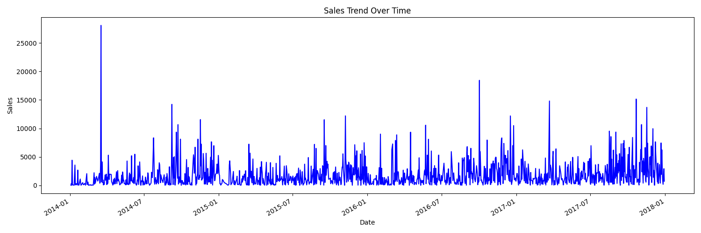
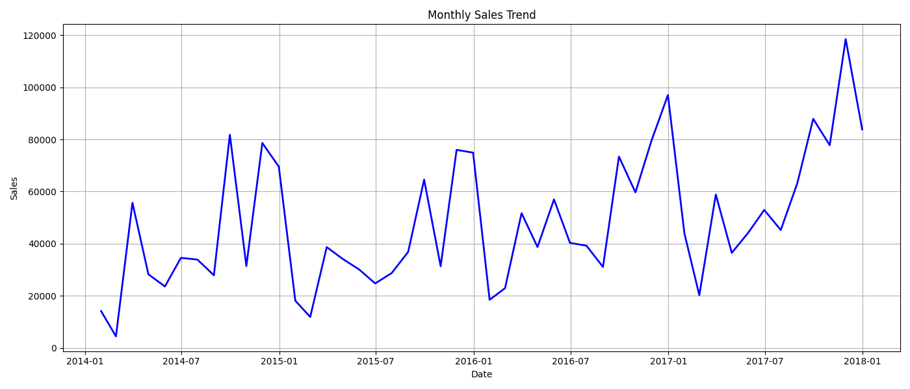
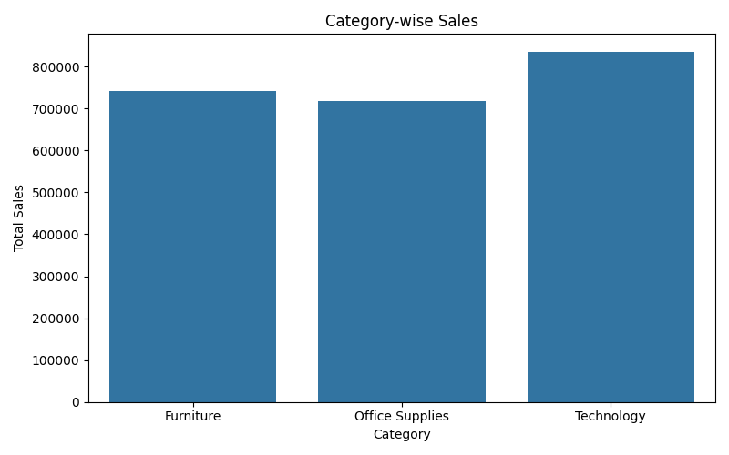
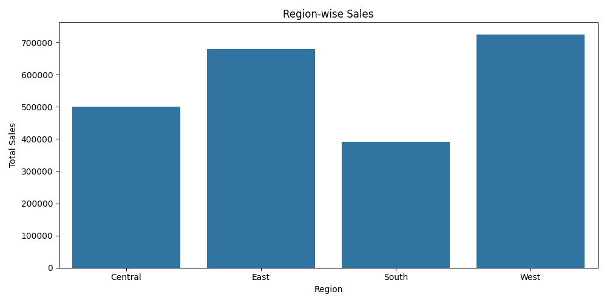
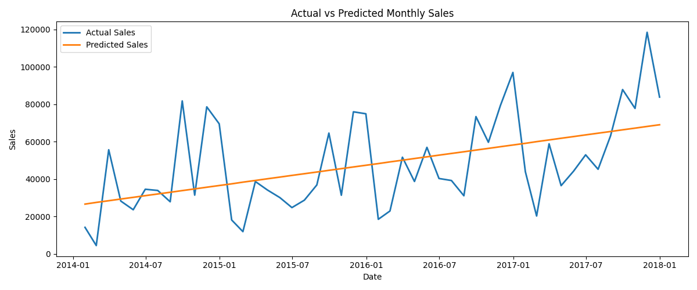
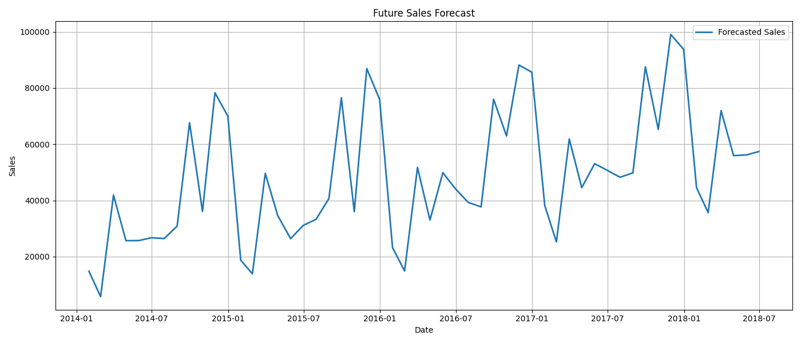
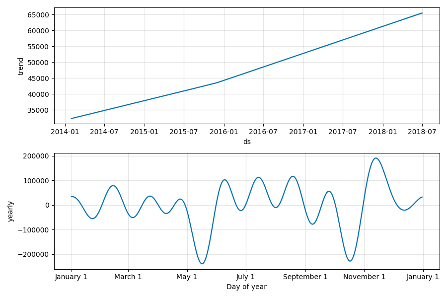

# Sales Forecasting Project using Machine Learning

## Project Overview

This project focuses on forecasting future business sales using historical retail data from the Superstore dataset. The system performs data preprocessing, exploratory data analysis, time-series forecasting, model evaluation, and business insight generation.

The forecasting model helps businesses understand historical sales behavior and predict future demand for better operational and strategic planning.

---

# Objectives

- Analyze historical sales trends
- Identify seasonality patterns in sales
- Forecast future monthly sales
- Evaluate forecasting model performance
- Generate business-oriented insights
- Visualize historical and predicted sales trends

---

# Technologies Used

- Python
- Pandas
- NumPy
- Matplotlib
- Seaborn
- Prophet (Facebook Prophet)
- Scikit-learn

---

# Project Structure

```bash
FUTURE_ML_01/
│
├── data/
│   ├── raw/
│   │   └── Sample-Superstore.csv
│   └── processed/
│
├── images/
│   ├── category_sales.png
│   ├── region_sales.png
│   ├── sales_trend.png
│   ├── monthly_sales_trend.png
│   ├── forecast.png
│   ├── final_forecast.png
│   └── forecast_components.png
│
├── outputs/
│   ├── business_insights.txt
│   ├── evaluation_metrics.txt
│   ├── forecast.csv
│   └── future_forecast.csv
│
├── src/
│   ├── data_preprocessing.py
│   ├── eda.py
│   ├── forecasting.py
│   ├── evaluation.py
│   ├── insights.py
│   └── main.py
│
├── requirements.txt
├── .gitignore
└── README.md
````

---

# Dataset Information

Dataset Used:

* Superstore Sales Dataset

The dataset contains:

* Order information
* Product categories
* Regional sales
* Customer segments
* Profit and sales metrics

---

# Workflow

## 1. Data Preprocessing

The preprocessing stage includes:

* Removing duplicate records
* Converting date columns into datetime format
* Sorting data by order date
* Creating time-based features

### Engineered Features

* Year
* Month
* Quarter
* DayOfWeek

---

# 2. Exploratory Data Analysis (EDA)

Several visualizations were created to analyze sales behavior and identify trends.

## Sales Trend Over Time

Displays daily sales fluctuations across the complete timeline.



---

## Monthly Sales Trend

Shows aggregated monthly sales behavior and long-term trends.



---

## Category-wise Sales

Compares total sales across different product categories.

Categories analyzed:

* Furniture
* Office Supplies
* Technology



---

## Region-wise Sales

Analyzes sales contribution from different business regions.

Regions analyzed:

* Central
* East
* South
* West



---

# 3. Forecasting Model

The project uses Facebook Prophet for time-series forecasting.

## Why Prophet?

Prophet was selected because it:

* Handles seasonality effectively
* Captures long-term trends automatically
* Works well with business time-series data
* Supports future forecasting easily
* Performs well even with irregular fluctuations

---

# Forecasting Process

The forecasting workflow includes:

1. Monthly sales aggregation
2. Prophet model training
3. Future month generation
4. Forecast prediction
5. Forecast visualization
6. Trend and seasonality analysis

---

# 4. Forecast Visualization

## Actual vs Predicted Monthly Sales

This visualization compares actual sales with predicted sales values generated by the forecasting model.



---

## Future Sales Forecast

Displays future predicted sales trends for upcoming months.



---

## Forecast Components

Prophet decomposes the forecast into:

* Trend
* Yearly seasonality



---

# 5. Model Evaluation

The forecasting model was evaluated using the following metrics:

## Mean Absolute Error (MAE)

Measures the average forecasting error.

## Root Mean Squared Error (RMSE)

Measures prediction performance while penalizing larger forecasting errors.

---

# Final Model Performance

| Metric                         | Value   |
| ------------------------------ | ------- |
| Mean Absolute Error (MAE)      | 5665.15 |
| Root Mean Squared Error (RMSE) | 7260.16 |

The model demonstrates acceptable forecasting performance for retail sales prediction tasks.

---

# Business Insights

The analysis generated the following business insights:

* Technology products generate the highest sales revenue among all categories.
* The Western region contributes the highest overall sales performance.
* Monthly sales exhibit strong seasonal fluctuations.
* Forecasting indicates an overall upward growth trend in future sales.
* Businesses should optimize inventory and logistics before peak sales periods.
* Seasonal demand planning can help reduce stock shortages and overstocking risks.

---

# How Businesses Can Use This Project

Businesses can use this forecasting system to:

* Improve inventory management
* Prepare for seasonal demand
* Optimize staffing requirements
* Improve supply chain planning
* Support financial forecasting
* Reduce operational losses

---

# How to Run the Project

## Step 1: Clone Repository

```bash
git clone https://github.com/MD-FAIZ0453/FUTURE_ML_01.git
```

---

## Step 2: Navigate to Project Folder

```bash
cd FUTURE_ML_01
```

---

## Step 3: Install Dependencies

```bash
pip install -r requirements.txt
```

---

## Step 4: Run the Project

```bash
python src/main.py
```

---

# Output Files Generated

The project automatically generates:

## Visualizations

* Sales trend charts
* Category analysis charts
* Regional sales charts
* Forecast plots
* Forecast component analysis

## CSV Outputs

* Forecasted sales data
* Future sales predictions

## Text Reports

* Evaluation metrics
* Business insights

---

# Future Improvements

Possible future enhancements include:

* Streamlit dashboard deployment
* ARIMA and LSTM model comparison
* Hyperparameter tuning
* Real-time forecasting dashboard
* Interactive Plotly visualizations
* Advanced business KPI analysis

---

# Conclusion

This project demonstrates how Machine Learning and time-series forecasting can support real business decision-making through sales trend analysis and future demand prediction.

The forecasting pipeline successfully combines:

* Data preprocessing
* Exploratory analysis
* Time-series forecasting
* Evaluation metrics
* Business insight generation

to create a complete business-oriented forecasting solution.

---

# Author

MD FAIZ

Machine Learning Intern Project – Future Interns

```
```
